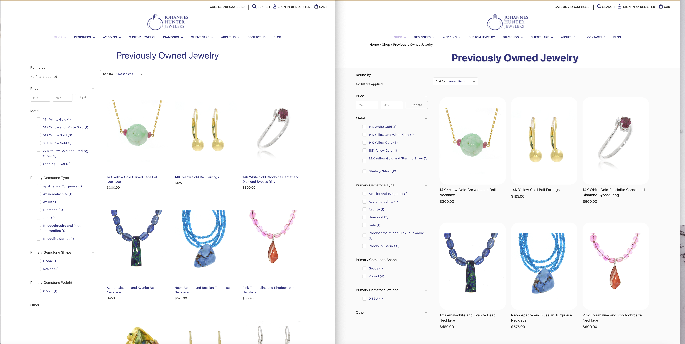

# Johannes
Just to host a few images of suggested/potential theme updates. 

&nbsp;
&nbsp;

I checked out your website's overall theme and design -- and looked it over on AHREFs to peek at it's organic performance, and to get an idea of the work already done on it. Overall it's a lovely website with a lot of time and effort put into it. It's growth in regard to organic visibility the last 1-2 years has been great. I noticed a few opportunities to make it even better. A few SEO related things sure -- but today I made this repository to exemplify some possible theme enhancements that are possible to make it POP just a little more. 
&nbsp;
Below I provide two screenshots to of some mockups/design changes I threw together to give you an idea of potential design changes. 
&nbsp;
Please go easy on the designs -- as I simply threw together these changes in the browser's DOM without much planning (plus engaging in what I'd call 'quasi-theme design' in the browser's DOM limits the extent of what I am reasonably able to do). 

&nbsp;
&nbsp;
&nbsp;

## Screenshot 1: Collections' Page - Design
This is screenshot showing the current Collections Page theme design (on the right), and on the left some minor edits I made that I think marginally improve it. You may need to click on the image to see it in full size. 
1) Added Breadcrumbs (for navigation) on the top left of the page.
2) I Modified the page tite's sizing, and font-weight to make it slightly bigger and bolder. 
3) I wanted to design more of a "product card" look. I made the page background lightgray and the product image's background white to give each product some constrast. Ideally we keep the page background white, and make the product background lightgrey instead. However, that was one of the constraints I had doing it in the browser (unable to change the white product background without converting the images from JPG to a transparent PNG).
4) I made each product card slightly larger (wider and taller) than they were by default to make the products easier to see.  
5) Changed the font size and color of the product titles.
6) Changed the font-weight of the price to make it bold. 

### Screenshot of Reflected Text 

&nbsp;
&nbsp;
